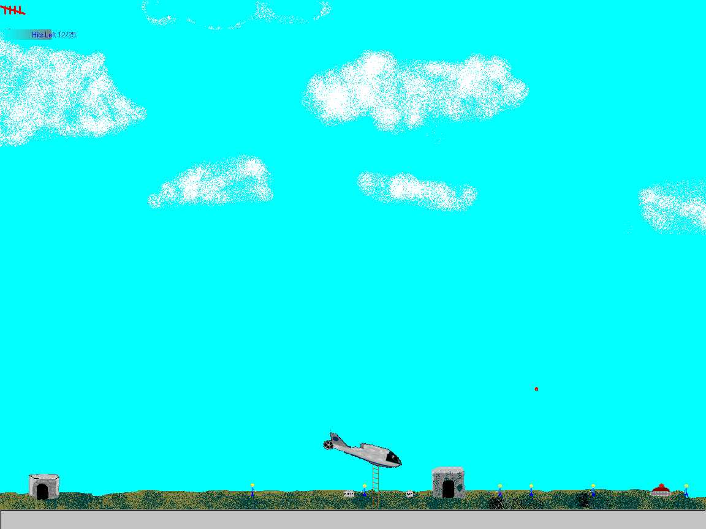



## Choplifter Update

### Description

This is an update to my earlier Choplifter. You can now define you keys, choose you difficulty level and skip the annoying beggining. A few bugs on the in-game play were fixed too.(Sorry, still haven't added the helicopter blades) But seriously, this game is a lot of fun. You're helicopter has a regular gun and then it also has bombs. You try to save the people below while dodging tank fire. In all honesty though, it's almost more fun just to kill the people and watch the little grave stones pop up in there place.

ENJOY!!!
 
### More Info
 

             |
---                |---
**Submitted On**   |2000-06-29 09:25:08
**By**             |[Chad Bjorklund](https://github.com/Planet-Source-Code/PSCIndex/blob/master/ByAuthor/chad-bjorklund.md)
**Level**          |Beginner
**User Rating**    |4.7 (14 globes from 3 users)
**Compatibility**  |VB 4\.0 \(16\-bit\), VB 4\.0 \(32\-bit\), VB 5\.0, VB 6\.0
**Category**       |[Games](https://github.com/Planet-Source-Code/PSCIndex/blob/master/ByCategory/games__1-38.md)
**World**          |[Visual Basic](https://github.com/Planet-Source-Code/PSCIndex/blob/master/ByWorld/visual-basic.md)
**Archive File**   |[CODE\_UPLOAD72766292000\.zip](https://github.com/Planet-Source-Code/chad-bjorklund-choplifter-update__1-9373/archive/master.zip)

